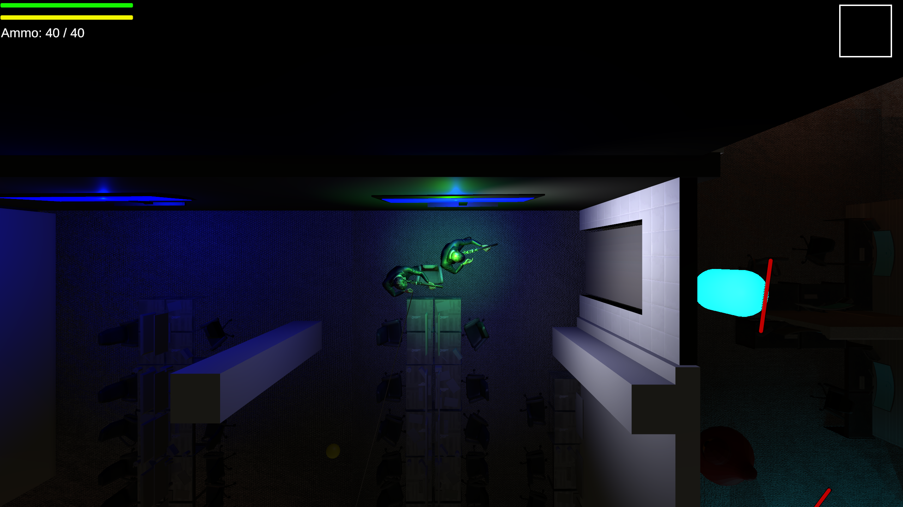
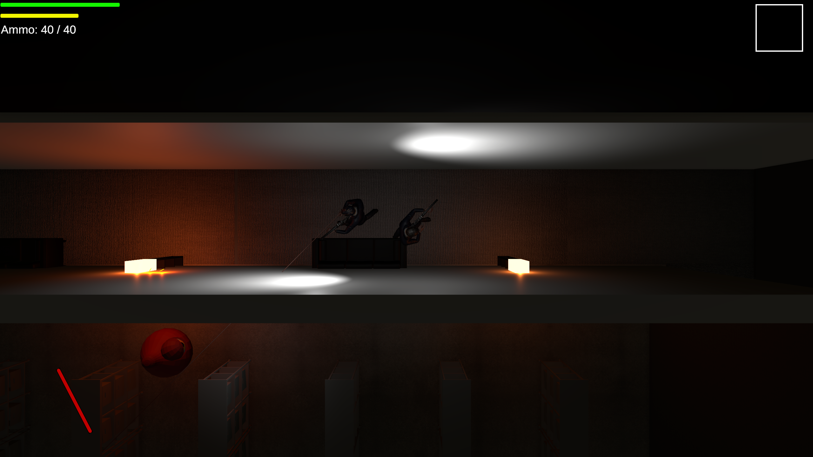
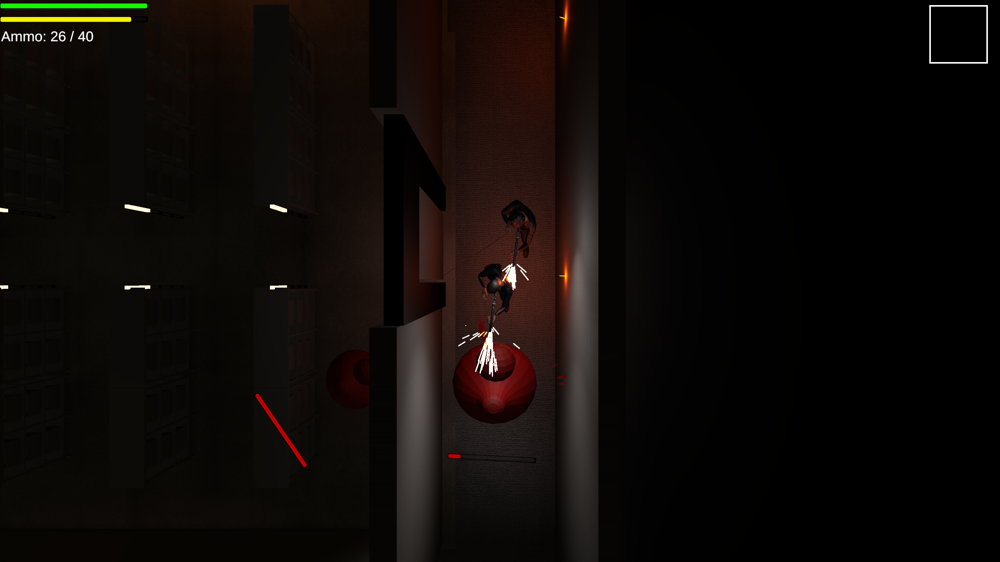
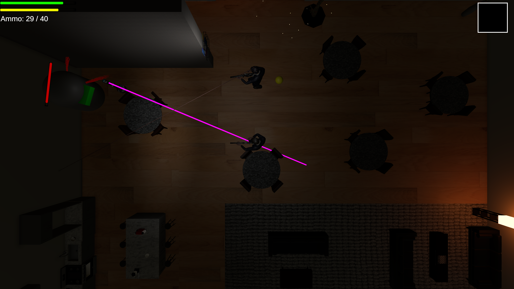
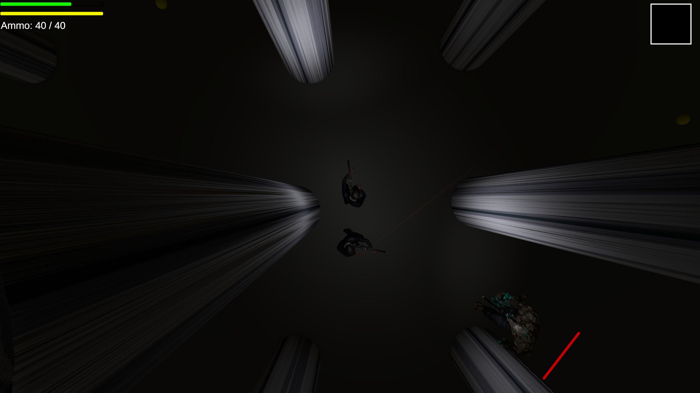
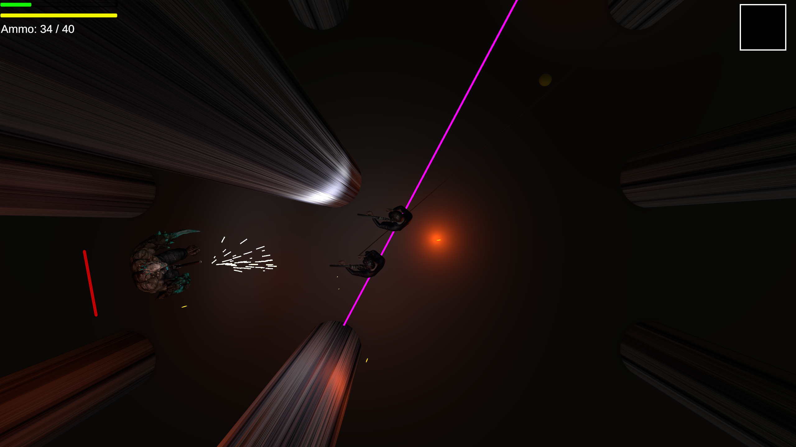
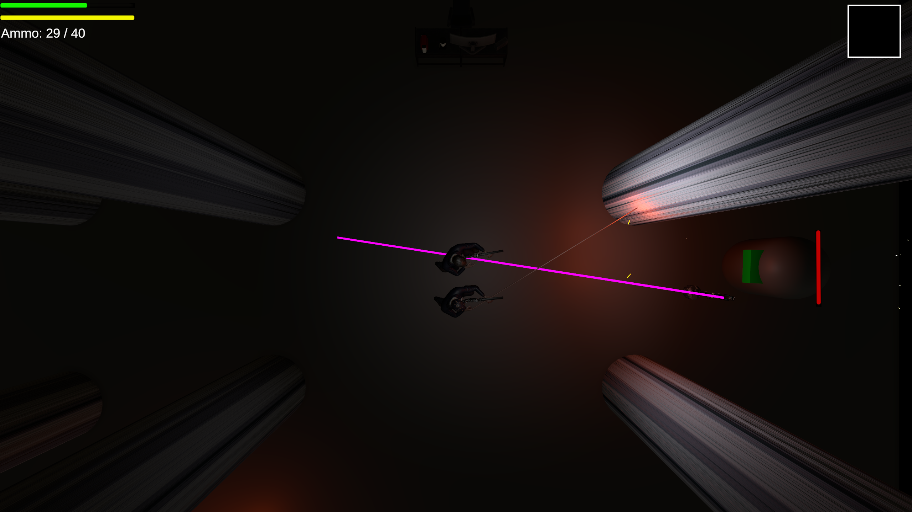

# Unity : Top Down Shooter

If you want to test the game, please go to my itch.io page : [Al3xics](https://al3xics.itch.io/). Download the zip file named **"Shoot Your Boss"**, decompress, and launch the .exe file. 
If you want to quit the game, please press **Alt + F4**, as there is no button to quit the game (the **"escape"** button will only pause the game without an interface). 
 

This project was made in only 2 weeks, and is about **creating different AI**. 
5 people worked on this game (including myself). 
Because of a lack of time, we didn't finish all of it, so there could still be some problem. 
 

Because the project is way too large to store it on github, I will not be able to show it. So try to play the game and discover what need improvement, is well made, or badly made, ... 
 

### Have fun, and try to see the different AI we created !!
 

# Here are some images of the game : 

